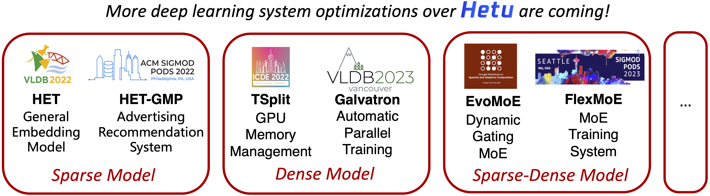

<div align=center>

</div>

# HETU

<!--- [](LICENSE) --->

[Documentation](https://hetu-doc.readthedocs.io) | [Examples](https://hetu-doc.readthedocs.io/en/latest/Overview/performance.html)

Hetu is a high-performance distributed deep learning system targeting trillions of parameters DL model training, developed by <a href="https://cuibinpku.github.io" target="_blank" rel="nofollow">DAIR Lab</a> at Peking University. It takes account of both high availability in industry and innovation in academia, which has a number of advanced characteristics:

- Applicability. DL model definition with standard dataflow graph; many basic CPU and GPU operators; efficient implementation of more than plenty of DL models and at least popular 10 ML algorithms.

- Efficiency. Achieve at least 30% speedup compared to TensorFlow on DNN, CNN, RNN benchmarks.

- Flexibility. Supporting various parallel training protocols and distributed communication architectures, such as Data/Model/Pipeline parallel; Parameter server & AllReduce.

- Scalability. Deployment on more than 100 computation nodes; Training giant models with trillions of model parameters, e.g., Criteo Kaggle, Open Graph Benchmark

- Agility. Automatically ML pipeline: feature engineering, model selection, hyperparameter search.

We welcome everyone interested in machine learning or graph computing to contribute codes, create issues or pull requests. Please refer to [Contribution Guide](CONTRIBUTING.md) for more details.

## Key Features

<div align=center>

</div>

## Installation
1. Clone the repository.

2. Prepare the environment. We use Anaconda to manage packages. The following command create the conda environment to be used:`conda env create -f environment.yml`. Please prepare Cuda toolkit and CuDNN in advance.

3. We use CMake to compile Hetu. Please copy the example configuration for compilation by `cp cmake/config.example.cmake cmake/config.cmake`. Users can modify the configuration file to enable/disable the compilation of each module. For advanced users (who not using the provided conda environment), the prerequisites for different modules in Hetu is listed in appendix.

```bash
# modify paths and configurations in cmake/config.cmake

# generate Makefile
mkdir build && cd build && cmake ..

# compile
# make all
make -j 8
# make hetu, version is specified in cmake/config.cmake
make hetu -j 8
# make allreduce module
make allreduce -j 8
# make ps module
make ps -j 8
# make geometric module
make geometric -j 8
# make hetu-cache module
make hetu_cache -j 8
```

4. Prepare environment for running. Edit the hetu.exp file and set the environment path for python and the path for executable mpirun if necessary (for advanced users not using the provided conda environment). Then execute the command `source hetu.exp` .


## Basic Usage

ResNet training on single gpu:

```bash
bash examples/cnn/scripts/hetu_1gpu.sh resnet18 CIFAR10
```

ResNet training with All-Reduce on 8 gpus:

```bash
bash examples/cnn/scripts/hetu_8gpu.sh resnet18 CIFAR10
```

BERT-base training on single gpu:

```bash
cd examples/nlp/bert && bash scripts/create_datasets_from_start.sh # Dataset preparing
bash scripts/train_hetu_bert_base.sh
```

BERT-base training with All-Reduce on 4 gpus:

```bash
cd examples/nlp/bert && bash scripts/create_datasets_from_start.sh # Dataset preparing
bash scripts/train_hetu_bert_base_dp.sh
```

Wide & Deep training on single gpu:

```bash
bash examples/ctr/tests/local_wdl_adult.sh
```

Wide & Deep training on 4 gpus using [HET](https://arxiv.org/abs/2112.07221):

```bash
bash examples/ctr/tests/hybrid_wdl_adult.sh
```

## More Examples
Please refer to examples directory, which contains CNN, NLP, CTR, MoE, GNN training scripts. If you want to know more about the communication architecture (parameter server, collective communication) and automatic parallelism (e.g., data parallel, tensor parallel, pipeline parallel, shared data parallel expert parallel) provided by Hetu, please join our community and contact with us!

## Community
* Email: xupeng.miao@pku.edu.cn
* Click [here](https://join.slack.com/t/hetu-ai/shared_invite/zt-1kpanxc83-9YndNPZYDH9orbR6MeIMbg) to join our Slack community.
* Hetu homepage: https://hetu-doc.readthedocs.io
* [Committers & Contributors](COMMITTERS.md)
* [Contributing to Hetu](CONTRIBUTING.md)
* [Development plan](https://hetu-doc.readthedocs.io/en/latest/plan.html)


## Enterprise Users

If you are enterprise users and find Hetu is useful in your work, please let us know, and we are glad to add your company logo here.

* Tencent Inc.


* Alibaba Cloud.


* Kuaishou Tech.


## License

The entire codebase is under [license](LICENSE)

## Papers

We have proposed numerous innovative optimization techniques around the Hetu system and published several papers, covering a variety of different model workloads and hardware environments.

### Embedding Model
  1. Xupeng Miao, Hailin Zhang, Yining Shi, Xiaonan Nie, Zhi Yang, Yangyu Tao, Bin Cui. [HET: Scaling out Huge Embedding Model Training via Cache-enabled Distributed Framework](https://arxiv.org/abs/2112.07221). **VLDB 2022 (Best Scalable Data Science Paper)** [[code]](https://github.com/Hsword/Het)
  2. Xupeng Miao, Yining Shi, Hailin Zhang, Xin Zhang, Xiaonan Nie, Zhi Yang, Bin Cui. [HET-GMP: a Graph-based System Approach to Scaling Large Embedding Model Training](https://dl.acm.org/doi/10.1145/3514221.3517902). **SIGMOD 2022** [[code]](https://github.com/Hsword/SIGMOD2022_HET-GMP)
  3. Sicong Dong, Xupeng Miao, Pengkai Liu, Xin Wang, Bin Cui, Jianxin Li. [HET-KG: Communication-Efficient Knowledge Graph Embedding Training via Hotness-Aware Cache](https://ieeexplore.ieee.org/document/9835364). **ICDE 2022**
  4. Hailin Zhang, Penghao Zhao, Xupeng Miao, Yingxia Shao, Zirui Liu, Tong Yang, Bin Cui. [Experimental Analysis of Large-scale Learnable Vector Storage Compression](https://arxiv.org/abs/2311.15578). **VLDB 2024** [[code]](https://github.com/Hsword/Hetu/tree/main/tools/EmbeddingMemoryCompression)
  5. Hailin Zhang, Zirui Liu, Boxuan Chen, Yikai Zhao, Tong Zhao, Tong Yang, Bin Cui. [CAFE: Towards Compact, Adaptive, and Fast Embedding for Large-scale Recommendation Models](https://arxiv.org/abs/2312.03256). **SIGMOD 2024** [[code]](https://github.com/HugoZHL/CAFE)

### Transformer Model
  6. Xupeng Miao, Yujie Wang, Youhe Jiang,  Chunan Shi, Xiaonan Nie, Hailin Zhang, Bin Cui. [Galvatron: Efficient Transformer Training over Multiple GPUs Using Automatic Parallelism](https://arxiv.org/abs/2211.13878). **VLDB 2023** [[code]](https://github.com/PKU-DAIR/Hetu/tree/main/tools/Galvatron)
  7. Youhe Jiang, Fangcheng Fu, Xupeng Miao, Xiaonan Nie and Bin Cui. [OSDP: Optimal Sharded Data Parallel for Distributed Deep Learning](http://arxiv.org/abs/2209.13258). **IJCAI 2023** [[code]](https://github.com/Youhe-Jiang/IJCAI2023-OptimalShardedDataParallel)
  8. Yujie Wang, Youhe Jiang, Xupeng Miao, Fangcheng Fu, Xiaonan Nie, Bin Cui. [Improving Automatic Parallel Training via Balanced Memory Workload Optimization](https://arxiv.org/abs/2307.02031). arXiv 2023 [[code]](https://github.com/PKU-DAIR/Hetu-Galvatron)

### Diffusion Model
  9. Zihao Yu, Haoyang Li, Fangcheng Fu,  Xupeng Miao, Bin Cui. [Accelerating Text-to-image Editing via Cache-enabled Sparse Diffusion Inference](http://arxiv.org/abs/2305.17423). **AAAI 2024** [[code]](https://github.com/Hankpipi/Hetu/tree/diffusers)

### Graph Neural Network
  10. Xupeng Miao, Yujie Wang, Jia Shen, Yingxia Shao, Bin Cui. Graph Neural Network Training Acceleration over Multi-GPUs. **Journal of Software (Chinese)**

### Mixture-of-experts Model
  11. Xiaonan Nie,  Xupeng Miao, Zilong Wang,  Jilong Xue and Lingxiao Ma, Zichao Yang, Gang Cao, Bin Cui. [FlexMoE: Scaling Large-scale Sparse Pre-trained Model Training via Dynamic Device Placement](https://arxiv.org/abs/2304.03946). **SIGMOD 2023**
  12. Xiaonan Nie, Shijie Cao, Xupeng Miao, Lingxiao Ma, Jilong Xue, Youshan Miao, Zichao Yang, Zhi Yang, Bin Cui. [EvoMoE: An Evolutional Mixture-of-Experts Training Framework via Dense-To-Sparse Gate](https://arxiv.org/abs/2112.14397). arXiv 2021 [[code]](https://github.com/codecaution/EvoMoE)
  13. Xiaonan Nie, Pinxue Zhao, Xupeng Miao, Tong Zhao, Bin Cui. [HetuMoE: An Efficient Trillion-scale Mixture-of-Expert Distributed Training System](https://arxiv.org/abs/2203.14685). arXiv 2022 [[code]](https://github.com/Hsword/Hetu/tree/main/examples/moe)

### Decentralized Hetetrogeneous Resources
  14. Xupeng Miao, Xiaonan Nie, Yingxia Shao, Zhi Yang, Jiawei Jiang, Lingxiao Ma, Bin Cui. [Heterogeneity-Aware Distributed Machine Learning Training via Partial Reduce](https://doi.org/10.1145/3448016.3452773). **SIGMOD 2021**
  15. Xupeng Miao, Yining Shi, Zhi Yang, Bin Cui, Zhihao Jia. [SDPipe: A Semi-Decentralized Framework for Heterogeneity-aware Pipeline-parallel Training](https://www.vldb.org/pvldb/vol16/p2354-miao.pdf). **VLDB 2023** [[code]](https://github.com/Hsword/VLDB2023_SDPipe)

### GPU Kernel
  16. Xupeng Miao, Lingxiao Ma, Zhi Yang, Yingxia Shao, Bin Cui, Lele Yu, Jiawei Jiang. [CuWide: Towards Efficient Flow-based Training for Sparse Wide Models on GPUs](https://ieeexplore.ieee.org/document/9261124). **TKDE 2021, ICDE 2021** [[code]](https://github.com/Hsword/cuWide)

### Memory Management
  17. Xiaonan Nie, Xupeng Miao, Zhi Yang, Bin Cui. [TSplit: Fine-grained GPU Memory Management for Efficient DNN Training via Tensor Splitting](https://ieeexplore.ieee.org/document/9835178). **ICDE 2022** [[code]](https://github.com/codecaution/TSplit)
  18. Xiaonan Nie, Yi Liu, Fangcheng Fu,  Jinbao Xue, Dian Jiao, Xupeng Miao, Yangyu Tao, Bin Cui. [Angel-PTM: A Scalable and Economical Large-scale Pre-training System in Tencent](http://arxiv.org/abs/2303.02868). **VLDB 2023**

### coming soon...

## Cite

If you use Hetu in a scientific publication, we would appreciate citations to the following papers:
```
 @article{DBLP:journals/chinaf/MiaoXP22,
   author = {Miao, Xupeng and Nie, Xiaonan and Zhang, Hailin and Zhao, Tong and Cui, Bin},
   title = {Hetu:  A highly efficient automatic parallel distributed deep learning system},
   journal = {Sci. China Inf. Sci.},
   url = {http://engine.scichina.com/doi/10.1007/s11432-022-3581-9},
   doi = {10.1007/s11432-022-3581-9},
   year = {2022},
 }
 
 @article{miao2021het,
   title={HET: Scaling out Huge Embedding Model Training via Cache-enabled Distributed Framework},
   author={Miao, Xupeng and Zhang, Hailin and Shi, Yining and Nie, Xiaonan and Yang, Zhi and Tao, Yangyu and Cui, Bin},
   journal = {Proc. {VLDB} Endow.},
   volume = {15},
   number = {2},
   pages = {312--320},
   year = {2022},
   publisher = {VLDB Endowment}
 }
```

## Acknowledgements

We learned and borrowed insights from a few open source projects including [TinyFlow](https://github.com/tqchen/tinyflow), [autodist](https://github.com/petuum/autodist), [tf.distribute](https://github.com/tensorflow/tensorflow/tree/master/tensorflow/python/distribute), [FlexFlow](https://github.com/flexflow/FlexFlow) and [Angel](https://github.com/Angel-ML/angel).

## Appendix
The prerequisites for different modules in Hetu is listed as follows:
  ```
  "*" means you should prepare by yourself, while others support auto-download
  
  Hetu: OpenMP(*), CMake(*)
  Hetu (version mkl): MKL 1.6.1
  Hetu (version gpu): CUDA 10.1(*), CUDNN 7.5(*), CUB 1.12.1(*), Thrust 1.16.0(*)
  Hetu (version all): both

  Hetu-AllReduce: MPI 3.1, NCCL 2.8(*), this module needs GPU version

  Hetu-PS: Protobuf(*), ZeroMQ 4.3.2

  Hetu-Geometric: Pybind11(*), Metis(*)

  Hetu-Cache: Pybind11(*), this module needs PS module

  ##################################################################
  Tips for preparing the prerequisites
  
  Preparing CUDA, CUDNN, CUB, NCCL(NCCl is already in conda environment):
  1. download from https://developer.nvidia.com 
  2. download CUB from https://github.com/NVIDIA/cub/releases/tag/1.12.1
  3. install
  4. modify paths in cmake/config.cmake if necessary
  
  Preparing OpenMP:
  Your just need to ensure your compiler support openmp.

  Preparing CMake, Protobuf, Pybind11, Metis:
  Install by anaconda: 
  conda install cmake=3.18 libprotobuf pybind11=2.6.0 metis

  Preparing OpenMPI (not necessary):
  install by anaconda: `conda install -c conda-forge openmpi=4.0.3`
  or
  1. download from https://download.open-mpi.org/release/open-mpi/v4.0/openmpi-4.0.3.tar.gz
  2. build openmpi by `./configure /path/to/build && make -j8 && make install`
  3. modify MPI_HOME to /path/to/build in cmake/config.cmake

  Preparing MKL (not necessary):
  install by anaconda: `conda install -c conda-forge onednn`
  or
  1. download from https://github.com/intel/mkl-dnn/archive/v1.6.1.tar.gz
  2. build mkl by `mkdir /path/to/build && cd /path/to/build && cmake /path/to/root && make -j8` 
  3. modify MKL_ROOT to /path/to/root and MKL_BUILD to /path/to/build in cmake/config.cmake 

  Preparing ZeroMQ (not necessary):
  install by anaconda: `conda install -c anaconda zeromq=4.3.2`
  or
  1. download from https://github.com/zeromq/libzmq/releases/download/v4.3.2/zeromq-4.3.2.zip
  2. build zeromq by 'mkdir /path/to/build && cd /path/to/build && cmake /path/to/root && make -j8`
  3. modify ZMQ_ROOT to /path/to/build in cmake/config.cmake
  ```
