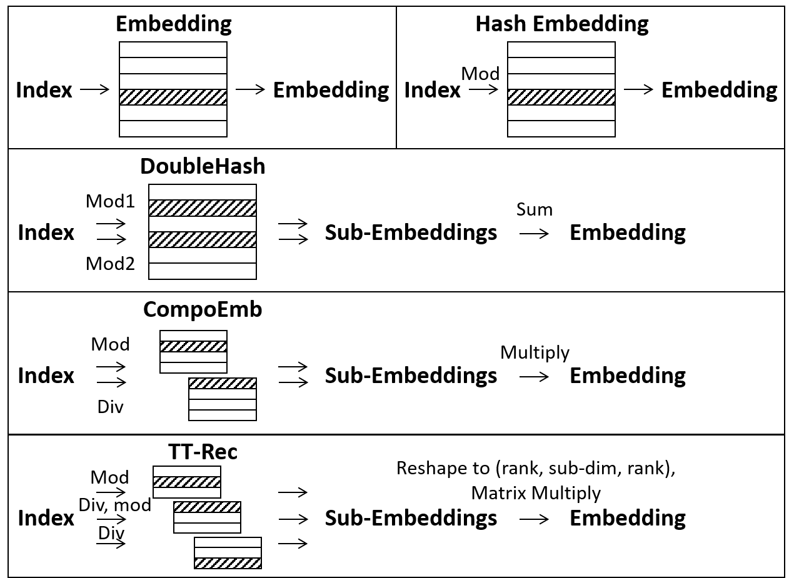

### TT-Rec: a static encoding compression method

We count TT-Rec as static encoding because the essence of TT-Rec is the complex composition of sub-embeddings from multiple hash embedding tables. As shown in the figure below, the process of TT-Rec follows the same pattern as CompoEmb. 
Within each small embedding table, the index is obtained by modulo-based hashing; 
the sub-embeddings are then composed together by matrix multiplications.
In this perspective, multiple features share a sub-embedding when a hash collision occurs, which is the same as in CompoEmb. 
The hash functions, which are actually modulo operations, are fixed during training. 
Therefore, we regard TT-Rec as a static encoding method.
Moreover, the term "intra-feature compression" is more restrictive than "inter-feature compression": "intra-feature compression" must not share embeddings among features, while "inter-feature compression" can compress the embedding itself to some extent. In TT-Rec, we focus on the sharing of sub-embeddings rather than the combination of sub-embeddings.

We do not include decomposition methods as a separate category because the original decomposition methods are performed on fixed-value matrices or tensors, not on trainable embedding tables. Compression methods for embedding tables may borrow ideas from tensor decomposition, but no one can claim that parameters trained on decomposition structures still have the theoretical guarantees of the original decomposition method. Therefore, we classify these methods according to the criteria of inter-feature and intra-feature compression. As discussed in the paper (Section 3.2.2), if projection matrices are employed, the dimension reduction methods can be viewed as the SVD decomposition of matrices. In this case, all features still have their own low-dimensional embeddings, so we consider these methods as intra-feature compression. In conclusion, decomposition methods should not be juxtaposed with intra- and inter-feature methods, but should be properly classified according to their nature.
