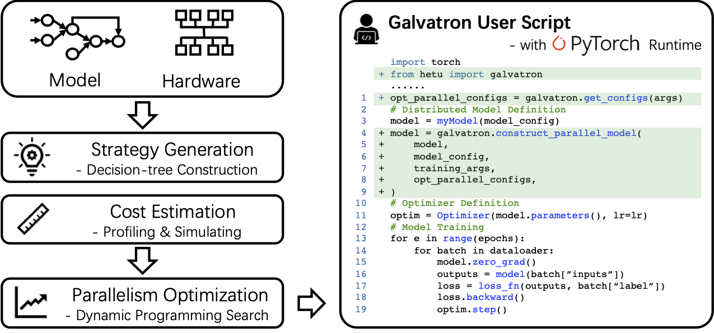

# Galvatron [VLDB'23]

Galvatron is an automatic distributed training system designed for Transformer models, including Large Language Models (LLMs). It leverages advanced automatic parallelism techniques to deliver exceptional training efficiency. 

We are continuously developing and updating Galvatron for better system performance and hardware utilization. 
Here we provide a stable version of latest Galvatron for experimental comparision usage. Please visit [Hetu-Galvatron](https://github.com/PKU-DAIR/Hetu-Galvatron) for more advanced features.

## System Architecture
Galvatron is consisted of four modules, including an automatic Galvatron Profiler, a strategy cost estimator, Galvatron Search Engine that provides parallelism optimization, and Galvatron runtime framework. To train Transformer models over multiple GPUs using automatic parallelism with Galvatron, users only need to provide with hardware environment and the Transformer model configuration.

<div align=center>  </div>

## Installation
Requirements:
- PyTorch 2.0.1 (we will support newer versions of pytorch soon)

To install Galvatron:

``` shell
pip install hetu-galvatron
```
Alternatively, you can install Galvatron from source with ```pip install .```

To use FlashAttention-2 features in Galvatron-2, you can either:
- Install the [FlashAttention-2](https://github.com/Dao-AILab/flash-attention) manually and then ```pip install hetu-galvatron```.
- Alternatively, you can install Galvatron-2 with FlashAttention-2 as follows:

1. Make sure that PyTorch, `packaging` (`pip install packaging`), `ninja` is installed.
2. Install Galvatron-2 with FlashAttention-2:
```sh
GALVATRON_FLASH_ATTN_INSTALL=TRUE pip install hetu-galvatron
```


## Usage

### Training with Galvatron
Galvatron provides a simple way to train Transformer models in fined-grained hybrid parallelism fashion. Users can either train Transformer models with the searched optimal parallel strategy by specifying argument ```galvatron_config_path``` to obtain the optimal throughput, or use any parallel strategies as they like. Galvatron support two hybrid parallel config modes, including JSON config mode and GLOBAL config mode. Users can specify parallel strategies by modifying only a few arguments. 

To train the model with Galvatron, ```cd galvatron/models/model_name```, set ```NUM_NODES, NUM_GPUS_PER_NODE, MASTER_ADDR, MASTER_PORT, NODE_RANK```,  and run:
``` shell
sh scripts/train_dist.sh
```

See detailed guidance and more customized training options in [Galvatron Model Usage](galvatron/models/README.md#training-with-galvatron).

## Cite

If you use Galvatron in a scientific publication, we would appreciate citations to the following paper:

```
@article{miao2023galvatron,
  title = {Galvatron: Efficient Transformer Training over Multiple GPUs Using Automatic Parallelism},
  author = {Miao, Xupeng and Wang, Yujie and Jiang, Youhe and Shi, Chunan and Nie, Xiaonan and Zhang, Hailin and Cui, Bin},
  journal = {Proc. {VLDB} Endow.},
  volume = {16},
  number = {3},
  pages = {470--479},
  year = {2023},
  doi = {10.14778/3570690.3570697},
  publisher = {VLDB Endowment},
}
```